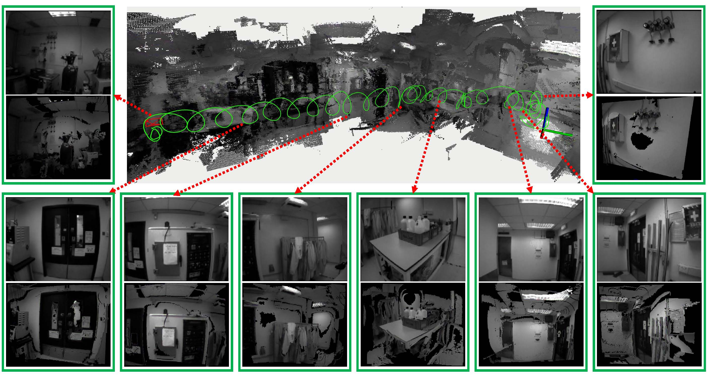

# Dataset of EVI-SAM

To benefit the community, we release the dataset that we utilized for real-time event-based dense mapping. This dataset also serves as a basis for comparing our event-based dense mapping approach with data captured from a depth camera.

## Event-based Handheld Device
Our handheld device includes a power supply unit, an onboard computer NUC (equipped with Intel i7-1260P, 32GB RAM, and Ubuntu 20.04 operation system), a DAVIS346 event camera, and a Intel® RealSense™ D455 RGB-D camera.
 
We release the all of our [schematic files](CAD_files_Sensor_kits.zip) with STL files format, which can be imported and printed directly. Moreover, we also release the CAD source files (with suffix “*.SLDPRT and *.SLDASM”), which can be opened and edited with Solidworks.

 

## Data Sequence
Please note that the depth maps provided by the depth camera only serve as references for qualitative comparison.

Sequence Name|Collection Date|Total Size|Rosbag (Baidu Disk)
:--|:--:|:--:|:--:
HKU_LG_office_1|2023-11|8.91 GB|[Rosbag](https://pan.baidu.com/s/13d-ktCJuzQ_Rz1JAtpFjAw?pwd=9hfs)
HKU_LG_office_2|2023-11|7.71 GB|[Rosbag](https://pan.baidu.com/s/13d-ktCJuzQ_Rz1JAtpFjAw?pwd=9hfs)
HKU_LG_office_3|2023-11|9.49 GB|[Rosbag](https://pan.baidu.com/s/13d-ktCJuzQ_Rz1JAtpFjAw?pwd=9hfs)
HKU_LG_office_4|2023-11|8.55 GB|[Rosbag](https://pan.baidu.com/s/13d-ktCJuzQ_Rz1JAtpFjAw?pwd=9hfs)
HKU_LG_office_5|2023-11|8.01 GB|[Rosbag](https://pan.baidu.com/s/13d-ktCJuzQ_Rz1JAtpFjAw?pwd=9hfs)
HKU_LG_factory_1|2023-11|6.13 GB|[Rosbag](https://pan.baidu.com/s/1cAzPKIURuq7mURr1XT1qlA?pwd=kx5s)
HKU_LG_factory_2|2023-11|5.98 GB|[Rosbag](https://pan.baidu.com/s/1cAzPKIURuq7mURr1XT1qlA?pwd=kx5s)
HKU_LG_factory_3|2023-11|6.33 GB|[Rosbag](https://pan.baidu.com/s/1cAzPKIURuq7mURr1XT1qlA?pwd=kx5s)
HKU_Logo_wall_1|2023-11|*** GB|[Rosbag](https://pan.baidu.com/s/1f2gSpIz3mwKS6a1IYRZBhw?pwd=cilv)
HKU_Logo_wall_2|2023-11|*** GB|[Rosbag](https://pan.baidu.com/s/1f2gSpIz3mwKS6a1IYRZBhw?pwd=cilv)
HKU_Logo_wall_3|2023-11|*** GB|[Rosbag](https://pan.baidu.com/s/1f2gSpIz3mwKS6a1IYRZBhw?pwd=cilv)

## Evaluation using EVI-SAM
The video demos of evaluating EVI-SAM using this dataset are available on **Bilibili**
[1](https://www.bilibili.com/video/BV1PH4y1k7kq/?spm_id_from=333.788&vd_source=a88e426798937812a8ffc1a9be5a3cb7)
[2](https://www.bilibili.com/video/BV1C94y1P7RX/?spm_id_from=333.788&vd_source=a88e426798937812a8ffc1a9be5a3cb7)
[3](https://www.bilibili.com/video/BV1DH4y1k7Y9/?spm_id_from=333.788&vd_source=a88e426798937812a8ffc1a9be5a3cb7)
.
The global mapping performance of our EVI-SAM is also illustrated in the following figur, showing the surface mesh generated through TSDF-based map fusion.
Our global event-based dense mapping exhibits excellent global consistency. 
The supplemental video also illustrates the incremental reconstruction of the event-based surface mesh from updated TSDF voxels. 
This process enables on-demand meshing for visualization, allowing flexibility in generating the mesh at any time.
Our TSDF-based map fusion for global mapping is designed to generate surface meshes that enable humans to assess the 3D reconstructed environment more effectively. 
This capability supports high-level mission goals, such as collision-free motion planning.
During evaluation, an onboard computer NUC is utilized to support real-time pose estimation and local event-based dense mapping.
However, the NUC lacks sufficient computational power to support a real-time meshing process.
Therefore, we utilize a personal computer (Intel i7-11800H, 32GB RAM) without GPU to output the global mesh of EVI-SAM for the global mapping evaluation.

 Visualization of the estimated camera trajectory and global 3D reconstruction (surface mesh) of our EVI-SAM. 
    Sequentially display from right to left includes the event-based dense point clouds with texture information and intensity images, at selected viewpoints. (click the image to open video demo)

## Evaluation using Traditional Image-based Dense Mapping
* We also use this dataset to evaluate some traditional image-based dense mapping methods using monocular, stereo, and RGB-D setup.
* A project of monocular dense mapping using RGB camera with VINS-MONO as pose estimation can be seen in [Github Repository](https://github.com/KwanWaiPang/Mono-VINS-DenseMapping).

## Evaluation using NeRF-based SLAM
* We also use this dataset to evaluate some NeRF-based SLAM works, such as [Nice-SLAM](https://openaccess.thecvf.com/content/CVPR2022/papers/Zhu_NICE-SLAM_Neural_Implicit_Scalable_Encoding_for_SLAM_CVPR_2022_paper.pdf), [Co-SLAM](https://openaccess.thecvf.com/content/CVPR2023/papers/Wang_Co-SLAM_Joint_Coordinate_and_Sparse_Parametric_Encodings_for_Neural_Real-Time_CVPR_2023_paper.pdf), [NeRF-SLAM](https://arxiv.org/pdf/2210.13641), and [InStant-NGP+COLMAP](https://dl.acm.org/doi/pdf/10.1145/3528223.3530127), etc.
* We provide a [toolbox](https://github.com/arclab-hku/Rosbag_to_TUMDataset) that converts the rosbag into TUM-data format.

