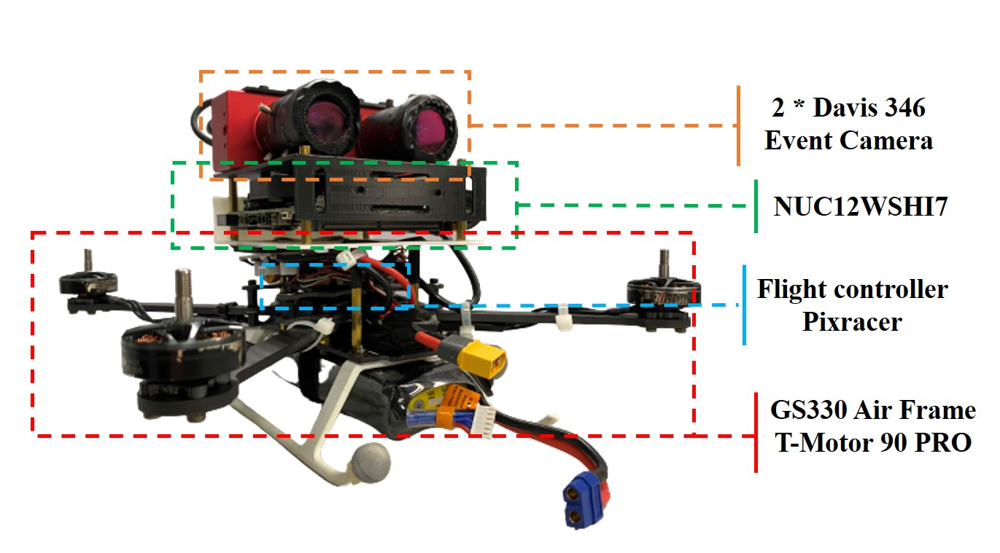
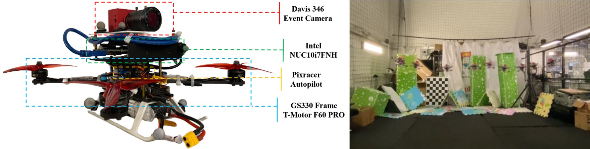
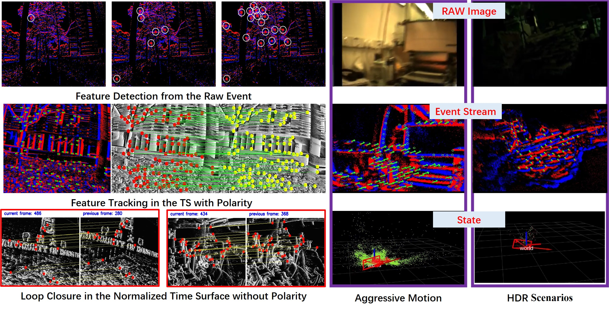
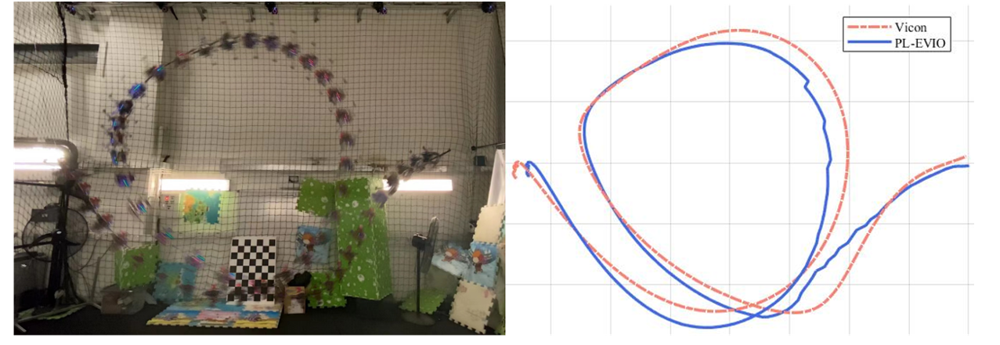

# An Event-based Dataset for VO/VIO/SLAM in Robotics

### Author: [Guan Weipeng](https://scholar.google.com/citations?hl=zh-CN&user=fUU5Cv0AAAAJ), [Chen Peiyu](https://github.com/cpymaple)

This is the repositorie that collects the dataset we used in our papers.
We also conclude our works in the field of event-based vision in robotics.
We hope that we can make some contributions for the development of event-based VO/VIO/SLAM.

- [Data Sequence for Event-based Stereo Visual-inertial Odometry](#Data-sequence-for-event-based-stereo-visual-inertial-odometry)
  - [Acquisition Platform](#acquisition-platform)
  - [Driver Installation](#driver-installation)
  - [Data Sequence](#data-sequence)
- [Data Sequence for Event-based Monocular Visual-inertial Odometry](#Data-sequence-for-event-based-monocular-visual-inertial-odometry)
  - [Acquisition Platform](#acquisition-platform-1)
  - [Data Sequence](#data-sequence-1)
- [Our Works in Event-based Vision](#our-works-in-event-based-vision)
  - [1. IROS2022](#1-iros2022)
  - [2. PL-EVIO](#2-pl-evio)
  - [3. ESVIO](#3-esvio)
- [Reference](#reference)

# Data Sequence for Event-based Stereo Visual-inertial Odometry
## Acquisition Platform

 The Platform for Data Collection 

 

* The configuration file is in [link](https://github.com/arclab-hku/Datasequence_Event_based_SLAM/tree/main/ESVIO)

## Driver Installation
We thanks the [rpg_dvs_ros](https://github.com/uzh-rpg/rpg_dvs_ros) for intructions of event camera driver.
However, it still has some problems.
We modified the source code of the [rpg_dvs_ros](https://github.com/uzh-rpg/rpg_dvs_ros) with consistent image size, and add the function of the hardware synchronized for stereo setup, the source code is available in [link](双目驱动源码).
After installing the driver, the user can directly run the following command:
~~~

~~~

## Data Sequence

HKU datasets:

Sequence Name|Collection Date|Total Size|Duration|Features|Rosbag
--|:--|:--:|--:|--:|--:
hku_agg_translation|---|3.63g|---|aggressive|[Rosbag](https://connecthkuhk-my.sharepoint.com/:u:/g/personal/chenpyhk_connect_hku_hk/EfM2ytBNx7dIiIX4QkMQVGIBzVtMHEf4pl4EWA81iQZKEw?e=T6RA57)
hku_agg_rotation|---|3.70g|---|aggressive|[Rosbag](https://connecthkuhk-my.sharepoint.com/:u:/g/personal/chenpyhk_connect_hku_hk/ER6-1BaiPJVOjlyG0Pau-vAB3oJ8eHK7hTVb2GmOUTjMpg?e=SQdYxH)
hku_agg_flip|---|3.71g|---|aggressive|[Rosbag](https://connecthkuhk-my.sharepoint.com/:u:/g/personal/chenpyhk_connect_hku_hk/EVPphYktymhEh4xF6Bp-S1EBdmHVj-YlBeDK1iu4_CakMg?e=6LuKuv)
hku_agg_walk|---|4.52g|---|aggressive|[Rosbag](https://connecthkuhk-my.sharepoint.com/:u:/g/personal/chenpyhk_connect_hku_hk/EYK8-WqZ001Pg6Kzdrau4NQBO7k21gahDB-22l1nyeKPkg?e=4pm4me)
hku_hdr_circle|---|2.91g|---|hdr|[Rosbag](https://connecthkuhk-my.sharepoint.com/:u:/g/personal/chenpyhk_connect_hku_hk/EZSKnWsvcbJHn9n0C69xAaUBtW7rnvBC7K59hximA8VrWg?e=TkgRye)
hku_hdr_slow|---|4.61g|---|hdr|[Rosbag](https://connecthkuhk-my.sharepoint.com/:u:/g/personal/chenpyhk_connect_hku_hk/EfLPELUuMHtOhFilZytwbPkB0wKAoi7YcJP8ERG2f2HrSA?e=PuLVxP)
hku_hdr_tran_rota|---|3.37g|---|aggressive & hdr|[Rosbag](https://connecthkuhk-my.sharepoint.com/:u:/g/personal/chenpyhk_connect_hku_hk/ERcfiPRffxJIjTVtZFADEZ8BnlC7vYTULNfi3myBM-17rA?e=d5lJuJ)
hku_hdr_agg|---|4.43g|---|aggressive & hdr|[Rosbag](https://connecthkuhk-my.sharepoint.com/:u:/g/personal/chenpyhk_connect_hku_hk/EZnpX0eqUc5MsR_mkNi7IEsBbLOI_GM9NRZebZvRQZHYEQ?e=qDGvN5)
hku_dark_normal|---|4.24g|---|dark & hdr|[Rosbag](https://connecthkuhk-my.sharepoint.com/:u:/g/personal/chenpyhk_connect_hku_hk/Edhb8MveJlVEhnltVt4vBIsB2kJu3K4t8dW1MTLgsJ5gLQ?e=wqwzNs)

Modified VECtor Dataset:
[VECtor dataset](https://star-datasets.github.io/vector/) covering the full spectrum of motion dynamics, environment complexities, and illumination conditions for both small and large-scale scenarios.
We modified the frequency of the event_left and event_right (60Hz) and the message format from "prophesee_event_msgs/EventArray" to "dvs_msgs/EventArray" in the [VECtor dataset](https://star-datasets.github.io/vector/), so that there is more event information in each frame and we can extract effective point and line features from the event stream. We release this modified VECtor Dataset to facilitate research on event camera. For the convenience of the user, we also fuse the individual rosbag from different sensors together (left_camera, right_camera, left_event, right_event, imu, groundtruth).

Sequence Name|Collection Date|Total Size|Duration|Features|Rosbag
--|:--|:--:|--:|--:|--:
board-slow|---|3.18g|---|---|[Rosbag](https://connecthkuhk-my.sharepoint.com/:u:/g/personal/chenpyhk_connect_hku_hk/EQcIz-Kf18pMl301YDr8KhQBfeziKZlb1zRBMWZBIezKLg?e=GTWE3t)
corner-slow|---|3.51g|---|---|[Rosbag](https://connecthkuhk-my.sharepoint.com/:u:/g/personal/chenpyhk_connect_hku_hk/ET0mYH9gDkVHuBmveuxPa8MB__oW7ti6H4a_JxduDglICw?e=TNMkyl)
robot-normal|---|3.39g|---|---|[Rosbag](https://connecthkuhk-my.sharepoint.com/:u:/g/personal/chenpyhk_connect_hku_hk/EUwmAXpA39hIvMTRIJvcZhQBBrj95f6E-MhKkVuvovqadw?e=mLFIcb)
robot-fast|---|4.23g|---|---|[Rosbag](https://connecthkuhk-my.sharepoint.com/:u:/g/personal/chenpyhk_connect_hku_hk/EUxG6axtQJxEquh79ZXDsX8BhhGq3QwRjW4MBz8xTXgPcg?e=In6eTJ)
desk-normal|---|8.82g|---|---|[Rosbag](https://connecthkuhk-my.sharepoint.com/:u:/g/personal/chenpyhk_connect_hku_hk/ESIpNEnxygNIhevd_2eMx3IB8a2qke2CqFWI6E_tCsN39Q?e=dtsnNu)
desk-fast|---|10.9g|---|---|[Rosbag](https://connecthkuhk-my.sharepoint.com/:u:/g/personal/chenpyhk_connect_hku_hk/EbtCM0It1R1FlEBk7XrcyWYB_CmOMNWtgL-8oGGg0uGylA?e=53WJlT)
sofa-normal|---|10.8g|---|---|[Rosbag](https://connecthkuhk-my.sharepoint.com/:u:/g/personal/chenpyhk_connect_hku_hk/EURPc2bQMkhOqw-ppGHPfqkBSCTLLucJCPHS53KZiJq9NA?e=147MeU)
sofa-fast|---|6.7g|---|---|[Rosbag](https://connecthkuhk-my.sharepoint.com/:u:/g/personal/chenpyhk_connect_hku_hk/ETQ16aZMg_RKqD7r7rTzpzUB3L1RNrUsxOqP2StB8PSPtA?e=Zh32Mn)
mountain-normal|---|10.9g|---|---|[Rosbag](https://connecthkuhk-my.sharepoint.com/:u:/g/personal/chenpyhk_connect_hku_hk/EfXGQD3k9uJDpgE6dkdo1-4BOueKcH3gLV-Y5mxZ6J-FlA?e=Lk6pht)
mountain-fast|---|16.6g|---|---|[Rosbag](https://connecthkuhk-my.sharepoint.com/:u:/g/personal/chenpyhk_connect_hku_hk/ERy_KiwAVmRHuHpMfNEruRkB3N8AKNcoz4PhM-D3BNVYhg?e=6Yuuau)
hdr-normal|---|7.73g|---|---|[Rosbag](https://connecthkuhk-my.sharepoint.com/:u:/g/personal/chenpyhk_connect_hku_hk/Ea0NpmfVv1ZPuzuMji23zugBwcAx5jpk1AIWSdsyOwJwCA?e=viYiOp)
hdr-fast|---|13.1g|---|---|[Rosbag](https://connecthkuhk-my.sharepoint.com/:u:/g/personal/chenpyhk_connect_hku_hk/ERggGm5O8mZKgMFcRGL9PrMBTerkSbiNZujROqQtUqBeNg?e=xCMtrZ)
corridors-dolly|---|7.78g|---|---|[Rosbag](https://connecthkuhk-my.sharepoint.com/:u:/g/personal/chenpyhk_connect_hku_hk/Ebd9sRvWt5NDuQm98pFt2moB8tUBXW6jVe5KEnzIu5QVhQ?e=G4PgKQ)
corridors-walk|---|8.56g|---|---|[Rosbag](https://connecthkuhk-my.sharepoint.com/:u:/g/personal/chenpyhk_connect_hku_hk/EagcclyPjMRPsTjM_0DtE-wBhZKCGiIXFHggPAWiX-OaBw?e=VMgWiE)
school-dolly|---|12.0g|---|---|[Rosbag](https://connecthkuhk-my.sharepoint.com/:u:/g/personal/chenpyhk_connect_hku_hk/EX4nOOrn0SFDrn14xncjINYBJA-YGjucLRUaJtEisoU8AQ?e=Tu3bAv)
school-scooter|---|5.91g|---|---|[Rosbag](https://connecthkuhk-my.sharepoint.com/:u:/g/personal/chenpyhk_connect_hku_hk/EXrOFgvdxh5Oja9wi7Kin_4Bbzgc15QtFkjYjVCqy20xWg?e=V5hiMq)
units-dolly|---|18.5g|---|---|[Rosbag](https://connecthkuhk-my.sharepoint.com/:u:/g/personal/chenpyhk_connect_hku_hk/Ea-XpjMCUoJDuAQ9mwVo6IcBzYTz-twRRL2VfQmfUkq02g?e=yJ9VSb)
units-scooter|---|11.6g|---|---|[Rosbag](https://connecthkuhk-my.sharepoint.com/:u:/g/personal/chenpyhk_connect_hku_hk/ERKuQIFBDP5FgxA_fqkTP0MB8xsVJ9l3aVUlDGjoZIK1bQ?e=FL3yDk)

# Data Sequence for Event-based Monocular Visual-inertial Odometry
## Acquisition Platform

 The Platform for Data Collection 

* The configuration file is in [link](https://github.com/arclab-hku/Datasequence_Event_based_SLAM/tree/main/IROS2022)

## Data Sequence
With VICON as ground truth:

Sequence Name|Collection Date|Total Size|Duration|Features|Rosbag
--|:--|:--:|--:|--:|--:
vicon_aggressive_hdr|---|23.0g|---|HDR, Aggressive Motion|[Rosbag](https://connecthkuhk-my.sharepoint.com/:u:/g/personal/wpguan_connect_hku_hk/ESxBPJlRT4FApeMZgwvAo4YBuAhoOT5tcb_A9dAvPSEeeg?e=CRDVrD)
vicon_dark1|---|10.5g|---|HDR|[Rosbag](https://connecthkuhk-my.sharepoint.com/:u:/g/personal/wpguan_connect_hku_hk/EaY7bfm8ZytGvlFP3v1TNHgBXMubjQvjiuoiZVqqEmA2jA?e=OyZyyU)
vicon_dark2|---|16.6g|---|HDR|[Rosbag](https://connecthkuhk-my.sharepoint.com/:u:/g/personal/wpguan_connect_hku_hk/Ed1hZLF4mOJJlz8nuk92evYByN9PkbrJE_xS8yuKy14ZUg?e=gYqWbg)
vicon_darktolight1|---|17.2g|---|HDR|[Rosbag](https://connecthkuhk-my.sharepoint.com/:u:/g/personal/wpguan_connect_hku_hk/EQwioJi0GqlKmc7j4BcDyQEB-YrX6HSk_FsEavKFYoihYw?e=24ZYdR)
vicon_darktolight2|---|14.4g|---|HDR|[Rosbag](https://connecthkuhk-my.sharepoint.com/:u:/g/personal/wpguan_connect_hku_hk/EWLO58HfLOxNpFdEQzJgZaoBq4Mo74ceZGcgUYlMLhUJbg?e=JNjn1x)
vicon_hdr1|---|13.7g|---|HDR|[Rosbag](https://connecthkuhk-my.sharepoint.com/:u:/g/personal/wpguan_connect_hku_hk/EfGW22iMVwZEoVCOdZ9cuHYB2_ZUXR0VA4QJBrRZMftzjA?e=BSuYih)
vicon_hdr2|---|16.9g|---|HDR|[Rosbag](https://connecthkuhk-my.sharepoint.com/:u:/g/personal/wpguan_connect_hku_hk/EVUTYAGK1a9HslLSffS3y9gBMQZYoZVxWPwaQUGLXzqVHQ?e=9N2zxZ)
vicon_hdr3|---|11.0g|---|HDR|[Rosbag](https://connecthkuhk-my.sharepoint.com/:u:/g/personal/wpguan_connect_hku_hk/Eafi0sYdsrpBrkbDt06gqf4BDAj8_MvzTETE1Kx8E6dpSA?e=3GC44d)
vicon_hdr4|---|19.6g|---|HDR|[Rosbag](https://connecthkuhk-my.sharepoint.com/:u:/g/personal/wpguan_connect_hku_hk/EXt_PrUjWgxNimNDCH9oM2gBcypymHdVrMh5r0hQf1AdAA?e=cUfNMA)
vicon_lighttodark1|---|17.0g|---|HDR|[Rosbag](https://connecthkuhk-my.sharepoint.com/:u:/g/personal/wpguan_connect_hku_hk/EfOYBysbkRtApSy6-qaMHVEBO7z92UZiQRRhYWnzCW-M1Q?e=sdvcV4)
vicon_lighttodark2|---|12.0g|---|HDR|[Rosbag](https://connecthkuhk-my.sharepoint.com/:u:/g/personal/wpguan_connect_hku_hk/EXjiHBhmoMlOvtP_T-WP2sgBhJKu9oL9ZpMUIOq-trG4ww?e=rAnaKQ)

indoor (no ground truth):

Sequence Name|Collection Date|Total Size|Duration|Features|Rosbag
--|:--|:--:|--:|--:|--:
indoor_aggressive_hdr_1|---|16.62g|---|HDR, Aggressive Motion|[Rosbag](https://drive.google.com/file/d/1dG7wVXdXIdvE-i1PGtUx5OcVMGyTeUkF/view?usp=share_link)
indoor_aggressive_hdr_2|---|15.66g|---|HDR, Aggressive Motion|[Rosbag](https://drive.google.com/file/d/15I709SGwTDspI6P89jxrm3gLenlSVInW/view?usp=sharing)
indoor_aggressive_test_1|---|17.94g|---|Aggressive Motion|[Rosbag](https://drive.google.com/file/d/1Ch-OruuoJXHmrUE8Q-k_IzWWPkd_QTL-/view?usp=sharing)
indoor_aggressive_test_2|---|8.385g|---|Aggressive Motion|[Rosbag](https://drive.google.com/file/d/1wvTuUtc0Xpj7Q9UJAEfezIt4EH5o9hjI/view?usp=sharing)
indoor_1|---|3.45g|---|---|[Rosbag](https://drive.google.com/file/d/1VL30PRG9COkfXx924n0Jmv24xnPHzGwT/view?usp=share_link)
indoor_2|---|5.31g|---|---|[Rosbag](https://drive.google.com/file/d/1uA1S3Vn3jJmFdE3IiIvzBihPpBYb-Dme/view?usp=share_link)
indoor_3|---|5.28g|---|---|[Rosbag](https://drive.google.com/file/d/1mYZi7uyXi9v8BOPFe_byK3QbQ9v4Ip1r/view?usp=share_link)
indoor_4|---|6.72g|---|---|[Rosbag](https://drive.google.com/file/d/1HbEPansHpFVjlVgwNYs_E4crdFiAfm8c/view?usp=share_link)
indoor_5|---|13.79g|---|---|[Rosbag](https://drive.google.com/file/d/1UI4WwjdUwBmGcJfTBE4G-DdmVsvLeaUh/view?usp=share_link)
indoor_6|---|20.39g|---|---|[Rosbag](https://drive.google.com/file/d/1KFrplYO86H1U6k00vFGc1pIK4onLUbjv/view?usp=share_link)

Outdoor (no ground truth):

Sequence Name|Collection Date|Total Size|Duration|Features|Rosbag
--|:--|:--:|--:|--:|--:
indoor_outdoor_1|---|20.87g|---|******|[Rosbag](https://drive.google.com/file/d/1xUJOpk8o2g56yISKmgySs0C0qQGA3QkM/view?usp=share_link)
indoor_outdoor_2|---|39.5g|---|******|[Rosbag](https://drive.google.com/file/d/1wrwE4zPDtmW5I0Rs5dH8RlCLKxobsIyA/view?usp=share_link)
outdoor_1|---|5.52g|---|******|[Rosbag](https://drive.google.com/file/d/1F82KOmjODJCDOvERApJiChYgkwtlEHo4/view?usp=share_link)
outdoor_2|---|5.27g|---|******|[Rosbag](https://drive.google.com/file/d/1yHX4LFosASry8AxO7VpPHB3bKLXmUrGJ/view?usp=share_link)
outdoor_3|---|6.83g|---|******|[Rosbag](https://drive.google.com/file/d/1UodGUbVTm0NK8M7MzcK7pB7yGp1klXX5/view?usp=share_link)
outdoor_4|---|7.28g|---|******|[Rosbag](https://drive.google.com/file/d/1Jx09q7K09VwXjUSnf3-B9RLoYIRiOtM6/view?usp=share_link)
outdoor_5|---|7.26g|---|******|[Rosbag](https://drive.google.com/file/d/1IB7dqqqPIZ2M-qwswaxtvTC0tCo-Ebwa/view?usp=share_link)
outdoor_6|---|5.38g|---|******|[Rosbag](https://drive.google.com/file/d/1IVV65qDk4CodTYc8AHn6KcT03xIpZtXZ/view?usp=share_link)
outdoor_round1|---|11.27g|---|******|[Rosbag](https://drive.google.com/file/d/1yBzT7xPi_O2WWVjRa-x1LEgGDT-dr6IL/view?usp=share_link)
outdoor_round2|---|13.34g|---|******|[Rosbag](https://drive.google.com/file/d/1W9zR2y_EnLA-MWoJjJQZIlYbj0320C3g/view?usp=share_link)
outdoor_round3|---|37.26g|---|******|[Rosbag](https://drive.google.com/file/d/1_EXmjIWtX4jWt2h3zjU3gO93JKxye_IQ/view?usp=share_link)

On quadrotor platform (PL-EVIO):

 The Platform for Data Collection 

* The configuration file is in [link](https://github.com/arclab-hku/Datasequence_Event_based_SLAM/tree/main/PL-EVIO)

Sequence Name|Collection Date|Total Size|Duration|Features|Rosbag
--|:--|:--:|--:|--:|--:
Vicon_dvs_fix_eight|---|1.08g|---|******|[Rosbag](https://connecthkuhk-my.sharepoint.com/:u:/g/personal/wpguan_connect_hku_hk/EeObT20UhbdDpemA3ZFwn7oB0UmbAmgqVObiQYwlZiBQCQ?e=j5H4ZU)
Vicon_dvs_varing_eight|---|1.48g|---|******|[Rosbag](https://connecthkuhk-my.sharepoint.com/:u:/g/personal/wpguan_connect_hku_hk/EWZPnY_Jr1lBiS2uglBysOIBEKdnHyyIGFqgg_oiVXT0BQ?e=UgrBCm)
outdoor_large_scale1|---|9.38g|---|******|[Rosbag](https://connecthkuhk-my.sharepoint.com/:u:/g/personal/chenpyhk_connect_hku_hk/EY7bTDAc6T5KkRgSB_VhhqYBnVdBYE80dJHwil7sVAeLMw?e=SN4PVU)
outdoor_large_scale2|---|9.34g|---|******|[Rosbag](https://connecthkuhk-my.sharepoint.com/:u:/g/personal/chenpyhk_connect_hku_hk/EQ5iXzEXjOFNvbqTMuuK03UBkcY7lDOCRuX0HwyZpR2blw?e=cCJQsu)

# Our Works in Event-based Vision
## 1. IROS2022 
* PDF can be downloaded in [here](https://github.com/arclab-hku/Event_based_VO-VIO-SLAM/blob/main/IROS2022/Monocular%20Event%20Visual%20Inertial%20Odometry%20Based%20on%20Event-Corner%20Using%20Sliding%20Windows%20Graph-Based%20Optimization.pdf)

 Demo Video (click the image to open) 

~~~
@inproceedings{GWPHKU:EVIO,
  title={Monocular Event Visual Inertial Odometry based on Event-corner using Sliding Windows Graph-based Optimization},
  author={Guan, Weipeng and Lu, Peng},
  booktitle={2022 IEEE/RSJ International Conference on Intelligent Robots and Systems (IROS)},
  pages={2438-2445},
  year={2022},
  organization={IEEE}
}
~~~

## 2. PL-EVIO 
* PDF can be downloaded in [here]()
* An extended version of our PL-EVIO: realizing high-accurate 6-DoF pose tracking and 3D semi-dense mapping (monocular event only) can be seen in [Link](https://www.bilibili.com/video/BV1924y1y7pn/?spm_id_from=333.999.0.0&vd_source=a88e426798937812a8ffc1a9be5a3cb7)

 Demo Video (click the image to open) 

 Onboard Quadrotor Flip using Our PL-EVIO (click the image to open) 

~~~
@article{PL-EVIO,
  title={PL-EVIO: Robust Monocular Event-based Visual Inertial Odometry with Point and Line Features},
  author={Guan, Weipeng and Chen, Peiyu and Xie, Yuhan and Lu, Peng},
  journal={arXiv preprint arXiv:2209.12160},
  year={2022}
}
~~~

## 3. ESVIO
* PDF can be downloaded in [here]()

~~~
 Coming soon
~~~

### If you have any suggestions or questions, do not hesitate to propose an issue. 

### And if you find our dataset helpful in your research, a simple star or citation are the best affirmation for us. :blush: 

# Reference
* More demo of event-based VO/VIO/SLAM can be seen in our bilibili [Guan Weipeng](https://space.bilibili.com/499377825?spm_id_from=333.1007.0.0) & [Chen Peiyu](https://space.bilibili.com/279299582/?spm_id_from=333.999.0.0)
* [Event Camera Calibration using dv-gui](https://blog.csdn.net/gwplovekimi/article/details/121637241?spm=1001.2014.3001.5501)
* The DAVIS comprises an image camera and event camera on the same pixel array, thus calibration can be done using standard image-based methods, such as [Kalibr](https://github.com/ethz-asl/kalibr)
* [Event-based Vision Resources](https://github.com/uzh-rpg/event-based_vision_resources)
* [Event-based Robot Vision by Prof. Guillermo Gallego](https://www.youtube.com/playlist?list=PL03Gm3nZjVgUFYUh3v5x8jVonjrGfcal8)

