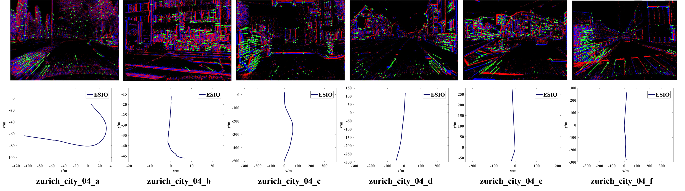

# Results (Raw Trajectories) of Our Methods

For the convenience of the community, we release the results of our methods, including the estimated 6-DoF pose and the ground truth, in the form of `rosbag`. 
Since our source code is only internal-accessed and not publicly available, we figure out this solution for benchmark testing and performance comparison rather than re-run the source code.
We strongly recommend the peers to evaluate their proposed works using our dataset and do the comparison with the raw results from our methods using their own accuracy criterion.

All the data sequences are evaluated in real-time. 
For the readers who are interested in the qualitative performance, please refer to our bilibili: :+1: :star: :moneybag: [Guan Weipeng](https://space.bilibili.com/499377825?spm_id_from=333.1007.0.0) or [Chen Peiyu](https://space.bilibili.com/279299582/?spm_id_from=333.999.0.0).
The evaluations of our works in different data sequences are recorded in video.

Tips: we recommend this [Python package](https://github.com/MichaelGrupp/evo) for the evaluation of odometry and SLAM.
e.g. If you want to align all estimated trajectory with ground truth in SE3 to calculate the Absolute Trajectory Error (ATE), you can run the following command:
~~~
evo_ape bag bag_name.bag /ground_truth_pose /estimated_pose -va -p
~~~
More details of the trajectory evaluation can be seen in [Link](https://github.com/KwanWaiPang/Poster_files/blob/main/trajectory_evaluation/evo_process.ipynb).

- [Our Own Dataset](#our-own-dataset)
- [Public Dataset](#public-dataset)
  - [VECtor](#VECtor)
  - [MVSEC](#MVSEC)
  - [DAVIS 240C Datasets](#DAVIS-240C-Datasets)
  - [DSEC](#DSEC)

# Our Own Dataset
Evaluation results in [our stereo event dataset](https://github.com/arclab-hku/Event_based_VO-VIO-SLAM#Data-sequence-for-event-based-stereo-visual-inertial-odometry) which are designed for stereo event-based VIO. 
Although this dataset uses stereo event cameras, it also would be good choice for the evaluation of monocular event-based VIO method.

 
 
Sequence Name|[PL-EVIO](https://arxiv.org/abs/2209.12160)|[ESIO](https://arxiv.org/abs/2212.13184) |[ESVIO](https://arxiv.org/abs/2212.13184)|
:--|:--:|:--:|:--:
Our results (raw trajectory)|[link](https://connecthkuhk-my.sharepoint.com/:f:/g/personal/chenpyhk_connect_hku_hk/EoP9dKKKH8NOsBut_U-p240BsfYXcSx0c_Y8MsR-OBsq2Q?e=fgc6kX)|[link](https://connecthkuhk-my.sharepoint.com/:f:/g/personal/chenpyhk_connect_hku_hk/EiuhqiP31Q1FoUulH1Qpg0sBpSnJMbxXUJlRBAR5kBZnoA?e=Ty41z8)|[link](https://connecthkuhk-my.sharepoint.com/:f:/g/personal/chenpyhk_connect_hku_hk/Eige1g2NYrtFhr69RxqU5p4BEJe6kG_2BwfMXiRjZuU3Og?e=vmFtCE)
hku_agg_translation|0.048|0.35|0.063
hku_agg_rotation|0.15|0.51|0.11
hku_agg_flip|0.15|1.23|0.14
hku_agg_walk|0.37|1.14|0.27
hku_hdr_circle|0.068|0.23|0.081
hku_hdr_slow|0.069|0.17|0.059
hku_hdr_tran_rota|0.068|0.60|0.065
hku_hdr_agg|0.14|1.37|0.10
hku_dark_normal|1.25|0.32|0.39

Evaluation results from monocular purely event-based VIO using different resolution event cameras `DAVIS346 (346x260)` and `DVXplorer (640x480)` in [our monocular event dataset](https://github.com/arclab-hku/Event_based_VO-VIO-SLAM#Data-sequence-for-event-based-monocular-visual-inertial-odometry):

Sequence Name|[EIO](https://ieeexplore.ieee.org/document/9981970) in DAVIS346|[EIO](https://ieeexplore.ieee.org/document/9981970) in DVXplorer|[PL-EIO](https://arxiv.org/abs/2209.12160) in DAVIS346|[PL-EIO](https://arxiv.org/abs/2209.12160) in DVXplorer
:--|:--:|:--:|:--:|:--:
Our results (raw trajectory)|[link](https://connecthkuhk-my.sharepoint.com/:f:/g/personal/chenpyhk_connect_hku_hk/EgSwO4tkJp1DsPnqDnrg7NUB-liAIGSweQFxDuqGFz5fow?e=kk1Pw8)|[link](https://connecthkuhk-my.sharepoint.com/:f:/g/personal/chenpyhk_connect_hku_hk/EtlwD7UFGRtJmwhpApTnFTIBf0kASxcXUZB-QTg_OoOPlQ?e=lIS6Qo)|[link](https://connecthkuhk-my.sharepoint.com/:f:/g/personal/chenpyhk_connect_hku_hk/Ejdo_fgKLHhGuyd4KdVw6PkBAtdku5wlejwqHZqBdeBC-w?e=hJqC0U)|[link](https://connecthkuhk-my.sharepoint.com/:f:/g/personal/chenpyhk_connect_hku_hk/Eqoayq33RdBApKvJQCA1F5sB2uN83NuMN8Fp057KfB0rbg?e=0PfX1Y)
vicon_aggressive_hdr|0.66|0.65|0.62|0.62
vicon_dark1|1.02|0.35|0.64|0.51
vicon_dark2|0.49|0.41|0.30|0.38
vicon_darktolight1|0.81|0.78|0.66|0.71
vicon_darktolight2|0.42|0.44|0.51|0.56
vicon_hdr1|0.59|0.30|0.67|0.47
vicon_hdr2|0.74|0.37|0.45|0.22
vicon_hdr3|0.72|0.69|0.74|0.47
vicon_hdr4|0.37|0.26|0.37|0.27
vicon_lighttodark1|0.29|0.42|0.33|0.43
vicon_lighttodark2|0.79|0.73|0.53|0.67

# Public Dataset
## VECtor
Evaluation results in the [VECtor](https://star-datasets.github.io/vector/).

  
Sequence Name|[PL-EVIO](https://arxiv.org/abs/2209.12160)|[ESVIO](https://arxiv.org/abs/2212.13184)|
:--|:--:|:--:
Our results (raw trajectory)|[link](https://connecthkuhk-my.sharepoint.com/:f:/g/personal/chenpyhk_connect_hku_hk/Ehtu7WlE_IpHjiOkF5R3YREBPmmD2U-tKYMHEbZiRMkqFA?e=FFOwc1)|[link](https://connecthkuhk-my.sharepoint.com/:f:/g/personal/chenpyhk_connect_hku_hk/Eo8EnI3BH_xBkKWTgFTsK7oBxYFe8MTuHGTJGp1jQGr1og?e=a31S8A)
board-slow|---|---
corner-slow|0.017|0.012
robot-normal|0.027|0.043
robot-fast|0.037|0.042
desk-normal|0.31|0.052
desk-fast|0.043|0.042
sofa-normal|0.058|0.047
sofa-fast|0.050|0.052
mountain-normal|0.32|0.044
mountain-fast|0.031|0.039
hdr-normal|0.12|0.017
hdr-fast|0.036|0.039
corridors-dolly|1.23|0.88
corridors-walk|0.72|0.34
school-dolly|3.11|0.53
school-scooter|1.39|0.63
units-dolly|13.82|8.12
units-scooter|11.66|6.64

## MVSEC
Evaluation results in [MVSEC](https://daniilidis-group.github.io/mvsec/).
Note that we use the whole and raw sequences without any timestamp modification, rather than just run part of the rosbag just like [ESVO](https://arxiv.org/pdf/2007.15548.pdf).

  
Sequence Name|[PL-EVIO](https://arxiv.org/abs/2209.12160)|[ESVIO](https://arxiv.org/abs/2212.13184)|
:--|:--:|:--:
Our results (raw trajectory)|[link](https://connecthkuhk-my.sharepoint.com/:f:/g/personal/chenpyhk_connect_hku_hk/EvlapmUwWF5Esn89dmcD958B7xkrfMkhL6AplFU-dtelrg?e=Z4T31C)|[link](https://connecthkuhk-my.sharepoint.com/:f:/g/personal/chenpyhk_connect_hku_hk/Ep4kVqpZpTdOje-d7mchpJkBuCEe3bIq-KDcccY3VSWOEQ?e=WY7oFt)
Indoor Flying 1|0.36|0.25
Indoor Flying 2|0.30|0.30
Indoor Flying 3|0.34|0.25
Indoor Flying 4|0.44|0.46

## DAVIS 240C Datasets
Evaluation results in [DAVIS 240C Datasets](https://rpg.ifi.uzh.ch/davis_data.html). We also refer the raw results of the other event-based VIO works (EIO: purely event-based VIO; EVIO: Event+Image VIO) as following:

  
Sequence Name|[CVPR17 EIO](https://openaccess.thecvf.com/content_cvpr_2017/papers/Zhu_Event-Based_Visual_Inertial_CVPR_2017_paper.pdf)|[BMVC17 EIO](https://rpg.ifi.uzh.ch/docs/BMVC17_Rebecq.pdf)|[UltimateSLAM EIO](https://rpg.ifi.uzh.ch/docs/RAL18_VidalRebecq.pdf)|[UltimateSLAM EVIO](https://rpg.ifi.uzh.ch/docs/RAL18_VidalRebecq.pdf)|[3DV19 EIO](https://www.research-collection.ethz.ch/bitstream/handle/20.500.11850/380462/1/3DV2019.pdf)|[RAL22 EVIO](https://arxiv.org/pdf/2204.05880.pdf)|[IROS22 EIO](https://ieeexplore.ieee.org/document/9981249)|[Our IROS22 EIO](https://ieeexplore.ieee.org/document/9981970)|[PL-EVIO](https://arxiv.org/abs/2209.12160)|
:--|:--:|:--:|:--:|:--:|:--:|:--:|:--:|:--:|:--:
Results (raw trajectory)|---|---|---|---|---|---|---|[link](https://connecthkuhk-my.sharepoint.com/:f:/g/personal/chenpyhk_connect_hku_hk/EmHMfp3xjiRLuq8w51WoMPUBpHQNznVZKC36hWH5T49iZw?e=0LWR6N)|---
boxes_translation      | 2.69 | 0.57 | 0.76             |0.27 | 2.55 | 0.48 |1.0| 0.34  | 0.06
hdr_boxes              | 1.23 | 0.92 | 0.67             |0.37 | 1.75 | 0.46 |1.8| 0.40  | 0.10
boxes_6dof             | 3.61 | 0.69 | 0.44             |0.30 | 2.03 | 0.84 |1.5| 0.61  | 0.21
dynamic_translation    | 1.90 | 0.47 | 0.59             |0.18 | 1.32 | 0.40 |0.9| 0.26  | 0.24
dynamic_6dof           | 4.07 | 0.54 | 0.38             |0.19 | 0.52 | 0.79 |1.5| 0.43  | 0.48
poster_translation     | 0.94 | 0.89 | 0.15             |0.12 | 1.34 | 0.35 |1.9| 0.40  | 0.54
hdr_poster             | 2.63 | 0.59 | 0.49             |0.31 | 0.57 | 0.65 |2.8| 0.40  | 0.12
poster_6dof            | 3.56 | 0.82 | 0.30             |0.28 | 1.50 | 0.35 |1.2| 0.26  | 0.14

Tips:
The estimated and ground-truth trajectories were aligned with a 6-DOF transformation (in SE3), using 5 seconds [0-5s] of the resulting trajectory. 
The result is obtained through computing the mean position error (Euclidean distance in meters) as percentages of the total traveled distance of the ground truth. 
`Unit: %/m` (e.g. 0.24 means the average error would be 0.24m for 100m motion). 
BTW: both [BMVC17](https://rpg.ifi.uzh.ch/docs/BMVC17_Rebecq.pdf) and [Ultimate SLAM](https://rpg.ifi.uzh.ch/docs/RAL18_VidalRebecq.pdf) release their raw results of this dataset in [here](https://rpg.ifi.uzh.ch/ultimateslam.html).
However, it seems that the released results is worse than the ones in the paper.

## DSEC
ESIO/ESVIO evaluation results on [DSEC](https://github.com/arclab-hku/Event_based_VO-VIO-SLAM?tab=readme-ov-file#Modified-dsec-dataset). The raw trajectories can be found in [here](https://connecthkuhk-my.sharepoint.com/:f:/g/personal/chenpyhk_connect_hku_hk/EqMe0ZL49opLlC0KlmkjHxkB81g5kryO9z3PS-sHveP32A?e=ci7G8h)

 Since the DSEC dataset does not provide the ground truth 6-DoF poses, we only show the qualitative results, the tracking performance of event-based and image-based features, of (a) ESIO and (b) ESVIO for the DSEC dataset sequences zurich_city_04_a to zurich_city_04_f. 

 

<!-- 

  

    
  

  

    
    
Since the DSEC dataset does not provide the ground truth 6-DoF poses, we only show the qualitative results, the tracking performance of event-based and image-based features, of (a) ESIO and (b) ESVIO for the DSEC dataset sequences zurich\_city\_04\_a to zurich\_city\_04\_f.

  

 -->

