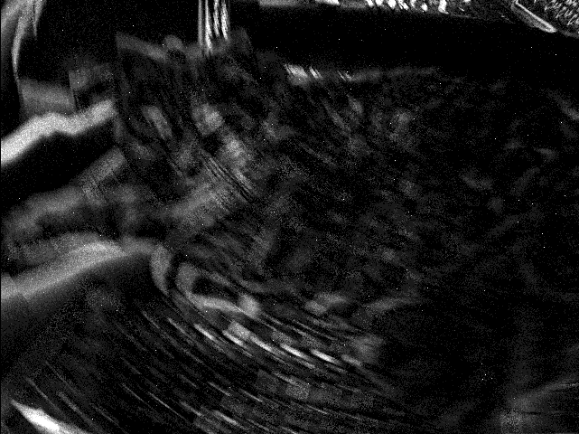
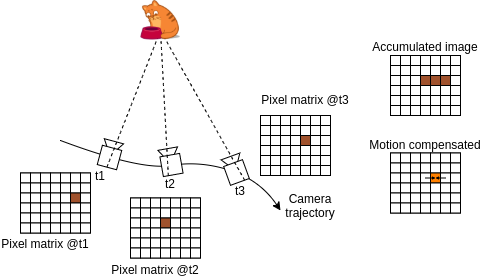
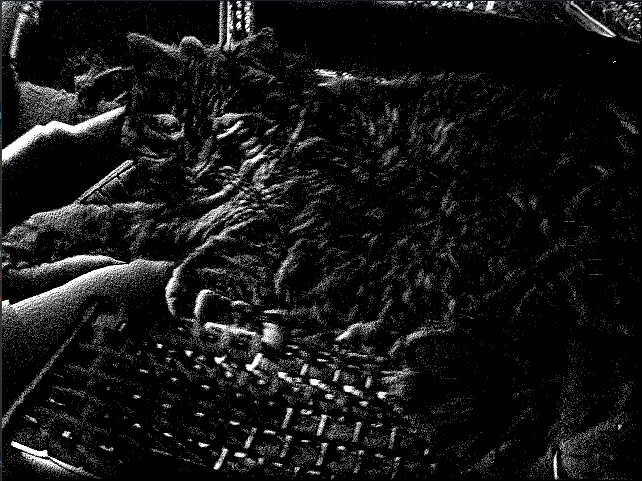

# Motion Aware Tracker

Motion-aware tracking is a methodology to improve tracking over visual and accumulated frames. The way the camera motion
is used is different for the two cases. In the following, we want to give a brief overview of the idea behind motion
compensation.

### Motion compensation with accumulated frames

Compensated frames are the images generated by summing up the events over a time window. For simplicity, we assume the
scene to be static and only the camera moves. When the camera performs fast and large movements, the sum of the events
can generate blurry images, as shown in the following image.

Tracking features in such images is problematic since the counters of the objects are not sharp. This effect could be
mitigated by reducing the time window where the events are accumulated. However, the result would be a few weak edges in
the frame when the motion is not a lot. To solve this problem, one could use the motion information of the camera to
align the events over time and obtain sharper edges. In this way, we can consider the direction the events have been
observed, so the result will be a stronger contour.

As shown by the following image, the motion compensation considers the point of the observation of the events.
Condensing them according to not just on a single plane but taking into account the different views of the trajectory.

The resulting motion-compensated frame looks like the following:

With sharp edges, the feature tracking is improved in terms of accuracy.

Prior information about the camera pose needs to be estimated to provide the tracker with this motion knowledge. This
estimate can result from IMU pre-integration of a VIO system or other external sensors (e.g., encoders). The
DV-processing library tracker class accepts the pose prior as a `Transform` type. The ROS wrapper subscribes to
a `PoseStamped` message type that streams the prior position of the camera and feeds the tracker with the Transform
information.

To better guess the camera viewpoint and hence improve the image compensation, depth information about the scene is
required. The tracker class can accept the `Depth` type and the ROS wrapper can provide it reading from the `Depth`
message type topic.

According to the timestamp they carry, the DV-processing tracker class does an interpolation of the pose, the depth, and
the visual inputs streams (events/frames). The result of this interpolation is an estimate of the camera point of view
and scene depth used to align the events.

### Motion compensation with visual frames

The visual frame's motion compensation is different. The motion prior is used to guess where the tracked feature points
can land in the next frame. In this way, the search areas for the Lucas Kanade Tracker are defined according to the
motion information. As shown in the following image, the red, green, and blue arrows represent the keypoint position
estimated with the motion information only, the keypoints position detected using the motion prediction information in
the Lucas Kanade tracker, the Lucas Kanade tracker only without motion prior respectively. The motion prediction plays
an essential role in the correct keypoints detection, avoiding outliers.

