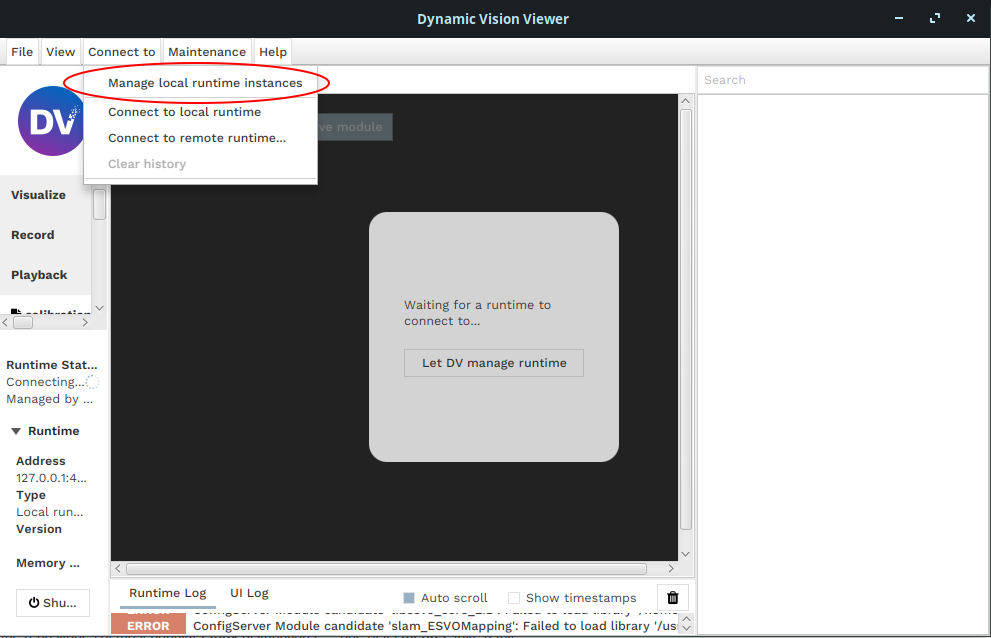
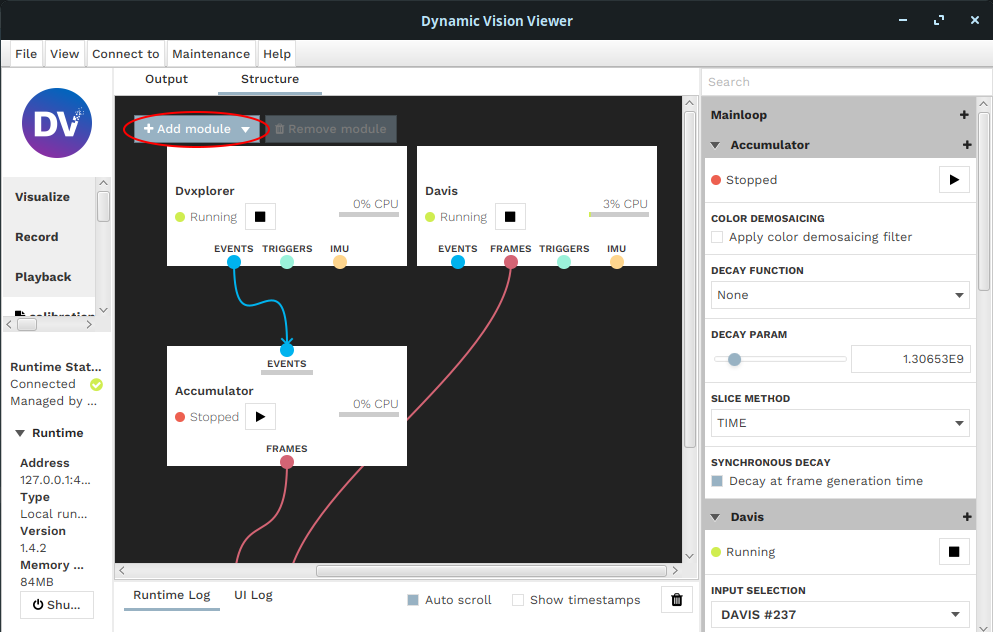
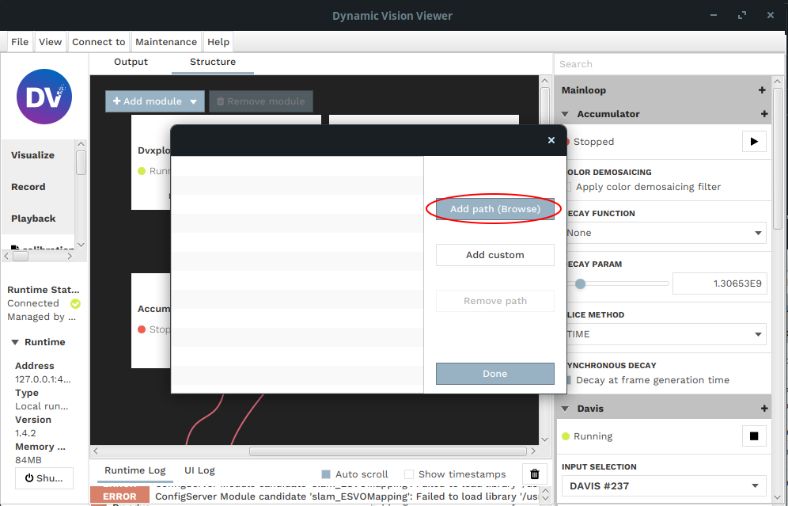
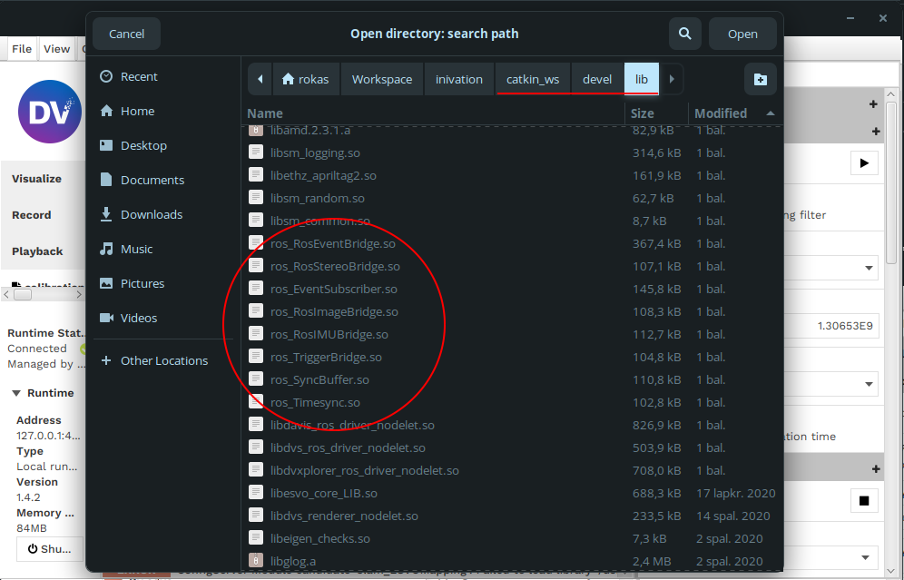

# DV ROS Runtime Modules

This repository provides modules for DV which publishes images / events from the DV Software into ROS.

## Build instructions

The modules are built using ROS catkin build tools. Code was tested ROS Melodic and Noetic releases. Follow these instructions:

1. After building the project, open GV-GUI and disable "Manage local runtime instances" under "Connect to" drop down button:
   
2. Run `dv-runtime` from a terminal that has ROS environment setup:
```
source ~/catkin_ws/devel/setup.sh
dv-runtime
```
3. Make sure `roscore` is already running.
4. The module binary `.so` files will be available in `/home/user/catkin_ws/devel/lib`, add this path to your DV-GUI search path:
   Click "Add module":
   
   Click "Modify module search paths":
   
   Click Browse to find the `devel/lib` directory or just paste plain text path using "Add custom" button:
   
   
5. The ROS bridge modules should be available in module list and functioning.
   


## Available modules

* ROS Event bridge - Event camera publisher, publishes events and camera calibration using DV calibration format.
* ROS Image bridge - Simple image frame publisher.
* ROS Imu Bridge - Publishes IMU messages.
* ROS Trigger Bridge - Publishes trigger messages.
